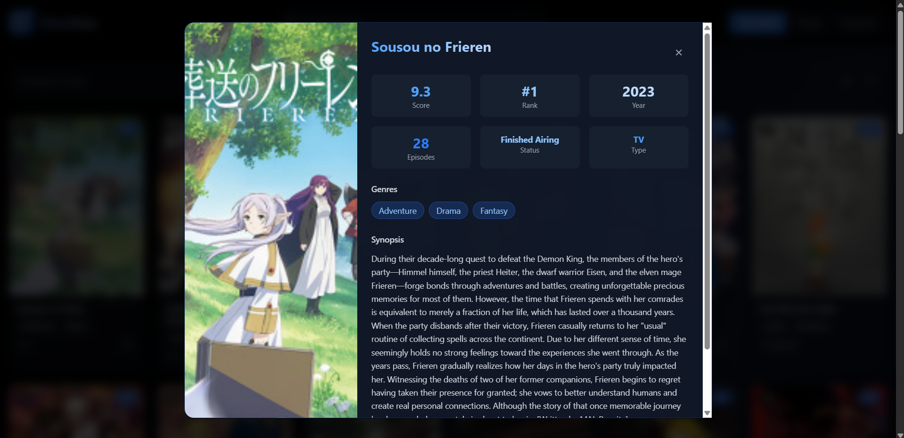

# Anime Explorer App

A full-stack web application for browsing, searching, and viewing anime information.  
Built with **FastAPI** (Python) for the backend and **Vue 3 + TypeScript + Vite** for the frontend.  
Containerized and easily deployable with **Docker Compose**.

---

## Features

- Browse top-rated, currently airing, and seasonal anime
- Search anime by title
- View detailed information for each anime
- Responsive and modern UI

---

## Screenshots

Home Page 

Anime Detail 

---

## Project Structure

```
ProjectParallelSytem/
├── backend/         # FastAPI backend
│   ├── main.py
│   ├── requirements.txt
│   └── Dockerfile
├── frontend/        # Vue 3 frontend
│   ├── src/
│   ├── package.json
│   └── Dockerfile
├── docker-compose.yml
└── README.md
```

---

## Getting Started

### Prerequisites

- [Docker Desktop](https://www.docker.com/products/docker-desktop) (includes Docker Compose)
- (Optional) [Git](https://git-scm.com/) for cloning the repository

---

### Deployment Steps

1. **Clone the Repository**
   ```sh
   git clone https://github.com/yourusername/your-repo-name.git
   cd your-repo-name
   ```

2. **Build and Run with Docker Compose**
   ```sh
   docker-compose up --build
   ```

3. **Access the Application**
   - Frontend: [http://localhost](http://localhost)
   - Backend API: [http://localhost:8000](http://localhost:8000)

4. **Stop the Application**
   Press `Ctrl+C` in the terminal, then run:
   ```sh
   docker-compose down
   ```

---

## Customization

- Update backend logic in `backend/main.py`
- Modify frontend UI in `frontend/src/`
- Add more features as needed!

---

## License

This project is licensed under the MIT License.

---

## Credits

- [Jikan API](https://jikan.moe/) for anime data
- [FastAPI](https://fastapi.tiangolo.com/)
- [Vue.js](https://vuejs.org/)